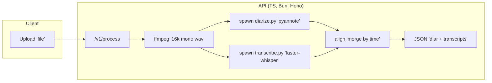

Below is a concise PRD and MVP implementation plan where all system components are in TypeScript (Hono on Bun) with Python and C++ used as CLI scripts. No microservices or separate servers - just direct script invocation.

Product Requirements Document (PRD): SpeakSlice TS + Scripts (MVP)

1) Overview
- Name: SpeakSlice (MVP)
- Goal: Given mp3/mp4/wav input, return:
  - Speaker diarization segments with timestamps and cluster labels (SPEAKER_00…)
  - Word-level transcript
  - Per-segment transcript grouped by diarized speaker
- Architecture:
  - Hono API (TypeScript, running on Bun) orchestrates the pipeline.
  - Python CLI script for diarization (pyannote) - invoked per request, outputs JSON to stdout.
  - Python CLI script for ASR (faster-whisper) - invoked per request, outputs JSON to stdout.
  - No microservices, no HTTP between components - just process spawning.
- Deployment: Single Docker container with Bun + Python, or local runtime.
- Cost: Free, CPU-first.

2) Success Criteria
- Input: mp3/mp4/wav up to 2 hours; ≤ 2 GB.
- Output: JSON with:
  - diarization.segments: [{ start, end, speaker, has_overlap }]
  - asr.words (word timestamps + confidences), asr.segments
  - aligned.speaker_segments: diarization segments with words and text
- Reliability: Handles typical meeting audio (2–5 speakers).
- Simplicity: One compose up command to run. Bun + uv images build cleanly.

3) Non-Goals (MVP)
- No speaker naming/enrollment.
- No UI; API only.
- No DB/job queue/streaming.
- Overlap: flagged if detected, not split by multiple speakers in the same instant.

4) Functional Requirements
4.1 Endpoints (Hono, TS)
- POST /v1/process
  - multipart/form-data: file
  - query/body optional:
    - asr_model: "tiny"|"base"|"small"|"medium" (default: "medium")
    - language: ISO code or "auto" (default "auto")
    - max_speakers: int | null (default null)
    - min_speaker_duration: float seconds (default 0.5)
    - enable_overlap: boolean (default true)
  - Response JSON:
    - file, duration_sec, sample_rate: 16000
    - diarization.segments: [{ start, end, speaker, has_overlap }]
    - asr.language, asr.words, asr.segments
    - aligned.speaker_segments: [{ start, end, speaker, text, words: [...] }]
    - meta.models: { diarization, asr }, timings_ms

- GET /v1/health
  - Returns 200 with model names and the diar service status.

4.2 Processing Pipeline (TS Orchestrator)
- Preprocess:
  - Save upload to temp.
  - Convert to mono 16 kHz WAV using ffmpeg (spawned from TS).
  - Compute duration.
- ASR (Python CLI, faster-whisper):
  - Spawn python transcribe.py with WAV path and model size.
  - Script outputs JSON with words and segments to stdout.
  - Parse JSON from stdout.
- Diarization (Python CLI script):
  - Spawn python diarize.py with WAV path and parameters.
  - Script outputs JSON to stdout.
  - Parse JSON from stdout.
- Alignment (TS):
  - For each diar segment, collect overlapping ASR words.
  - Join words to segment text.
  - Sort by time.
- Output:
  - Round time to 3 decimals.
  - Return full JSON as above.

5) Quality/Constraints
- File limits: Reject > 2h or > 2 GB with 413.
- Errors: 422 for media conversion failure, 500 if diarization or ASR script fails.
- Logging: request ID, timings, basic error details to stdout.
- CPU-first; optional GPU will be post-MVP.

6) System Design
- Single Service:
  - speakslice-api (Bun + Hono)
- CLI Scripts (bundled):
  - scripts/diarize.py (Python + pyannote, outputs JSON to stdout)
  - scripts/transcribe.py (Python + faster-whisper, outputs JSON to stdout)
- Communication: Direct process spawning via child_process.spawn()
- Storage: ephemeral /tmp on host or container filesystem
- Dependencies: Python 3.10+, ffmpeg, pyannote.audio, faster-whisper

Mermaid Diagram (high-level)


7) Implementation

7.1 TypeScript API (Hono on Bun)

- Package.json (Bun auto) not required. Use tsconfig for ESNext, moduleResolution: bundler.
- Install:
  - bun add hono nanoid
  - bun add -d @types/node typescript
- External Dependencies (system):
  - ffmpeg (audio conversion)
  - Python 3.10+ with pyannote.audio (diarization) and faster-whisper (ASR)

Note: All heavy lifting done by Python CLI scripts. TS is just orchestration and API layer.

Example server.ts
```ts
import { Hono } from "hono";
import { serve } from "hono/bun";
import { nanoid } from "nanoid";
import { spawn } from "node:child_process";
import { createWriteStream, promises as fs } from "node:fs";
import path from "node:path";
import os from "node:os";

type Word = { start: number; end: number; text: string; confidence?: number };
type ASRSeg = { start: number; end: number; text: string; avg_confidence?: number };
type DiarSeg = { start: number; end: number; speaker: string; has_overlap: boolean };

const app = new Hono();

const ASR_MODEL = process.env.ASR_MODEL || "medium";
const DIARIZE_SCRIPT = process.env.DIARIZE_SCRIPT || "./scripts/diarize.py";
const TRANSCRIBE_SCRIPT = process.env.TRANSCRIBE_SCRIPT || "./scripts/transcribe.py";
const PYTHON_BIN = process.env.PYTHON_BIN || "python3";

async function runFfmpegToWav16kMono(src: string, dst: string) {
  const args = ["-y", "-i", src, "-ac", "1", "-ar", "16000", "-vn", "-c:a", "pcm_s16le", dst];
  await new Promise<void>((resolve, reject) => {
    const p = spawn("ffmpeg", args);
    let err = "";
    p.stderr.on("data", (d) => (err += d.toString()));
    p.on("close", (code) => (code === 0 ? resolve() : reject(new Error(err))));
  });
}

async function getDurationSec(wavPath: string): Promise<number | null> {
  // Use ffprobe via ffmpeg to get duration
  return new Promise((resolve) => {
    const args = [
      "-v",
      "error",
      "-show_entries",
      "format=duration",
      "-of",
      "default=nw=1:nk=1",
      wavPath,
    ];
    const p = spawn("ffprobe", args);
    let out = "";
    p.stdout.on("data", (d) => (out += d.toString()));
    p.on("close", () => {
      const v = parseFloat(out.trim());
      resolve(Number.isFinite(v) ? Math.round(v * 1000) / 1000 : null);
    });
  });
}

async function callDiarizationScript(
  wavPath: string,
  opts: { max_speakers?: number | null; min_speaker_duration?: number; enable_overlap?: boolean }
): Promise<DiarSeg[]> {
  const args = [DIARIZE_SCRIPT, wavPath];
  if (opts.max_speakers != null) args.push("--max-speakers", String(opts.max_speakers));
  if (opts.min_speaker_duration != null) args.push("--min-speaker-duration", String(opts.min_speaker_duration));
  if (opts.enable_overlap != null) args.push("--enable-overlap", String(opts.enable_overlap));

  return new Promise((resolve, reject) => {
    const p = spawn(PYTHON_BIN, args);
    let stdout = "";
    let stderr = "";
    p.stdout.on("data", (d) => (stdout += d.toString()));
    p.stderr.on("data", (d) => (stderr += d.toString()));
    p.on("close", (code) => {
      if (code !== 0) {
        reject(new Error(`Diarization script failed: ${stderr}`));
      } else {
        try {
          const result = JSON.parse(stdout);
          resolve((result.segments ?? []) as DiarSeg[]);
        } catch (e) {
          reject(new Error(`Failed to parse diarization output: ${e}`));
        }
      }
    });
  });
}

function alignWordsToDiarization(words: Word[], diar: DiarSeg[]) {
  const aligned = [];
  let wi = 0;
  for (const seg of diar) {
    const s0 = seg.start;
    const s1 = seg.end;
    const segWords: Word[] = [];
    while (wi < words.length && words[wi].end <= s0) wi++;
    let wj = wi;
    while (wj < words.length && words[wj].start < s1) {
      const w = words[wj];
      if (w.end > s0 && w.start < s1) segWords.push(w);
      wj++;
    }
    const text = segWords.map((w) => w.text).join(" ").trim();
    aligned.push({
      start: s0,
      end: s1,
      speaker: seg.speaker,
      text,
      words: segWords,
    });
  }
  return aligned;
}

async function transcribeWithWhisper(
  wavPath: string,
  opts: { model: string; language?: string | "auto" }
): Promise<{ words: Word[]; segments: ASRSeg[]; language?: string }> {
  const args = [TRANSCRIBE_SCRIPT, wavPath, "--model", opts.model];
  if (opts.language && opts.language !== "auto") args.push("--language", opts.language);

  return new Promise((resolve, reject) => {
    const p = spawn(PYTHON_BIN, args);
    let stdout = "";
    let stderr = "";
    p.stdout.on("data", (d) => (stdout += d.toString()));
    p.stderr.on("data", (d) => (stderr += d.toString()));
    p.on("close", (code) => {
      if (code !== 0) {
        reject(new Error(`Transcription script failed: ${stderr}`));
      } else {
        try {
          const result = JSON.parse(stdout);
          resolve({
            words: result.words ?? [],
            segments: result.segments ?? [],
            language: result.language,
          });
        } catch (e) {
          reject(new Error(`Failed to parse transcription output: ${e}`));
        }
      }
    });
  });
}

app.get("/v1/health", async (c) => {
  // Check if Python scripts are accessible
  const scriptsExist = await Promise.all([
    fs.access(DIARIZE_SCRIPT).then(() => true).catch(() => false),
    fs.access(TRANSCRIBE_SCRIPT).then(() => true).catch(() => false),
  ]);

  return c.json({
    status: "ok",
    scripts: {
      diarization: scriptsExist[0] ? "found" : "missing",
      transcription: scriptsExist[1] ? "found" : "missing",
    },
    models: { diarization: "pyannote/speaker-diarization-3.1", asr: `faster-whisper-${ASR_MODEL}` },
  });
});

app.post("/v1/process", async (c) => {
  const form = await c.req.parseBody();
  const file = form["file"];
  if (!file || !(file as File).stream) {
    return c.text("file is required (multipart/form-data)", 400);
  }
  const asrModel = (form["asr_model"] as string) || ASR_MODEL;
  const language = ((form["language"] as string) || "auto") as string;
  const maxSpeakers =
    form["max_speakers"] != null && String(form["max_speakers"]).length > 0
      ? Number(form["max_speakers"])
      : null;
  const minSpeakerDuration =
    form["min_speaker_duration"] != null
      ? Number(form["min_speaker_duration"])
      : 0.5;
  const enableOverlap =
    form["enable_overlap"] != null
      ? String(form["enable_overlap"]).toLowerCase() === "true"
      : true;

  // Save upload
  const id = nanoid();
  const tmpDir = path.join(os.tmpdir(), `speakslice-${id}`);
  await fs.mkdir(tmpDir, { recursive: true });
  const srcPath = path.join(tmpDir, "input.bin");
  const outWav = path.join(tmpDir, "audio.wav");
  const write = createWriteStream(srcPath);
  const stream = (file as File).stream();
  const reader = stream.getReader();
  while (true) {
    const { done, value } = await reader.read();
    if (done) break;
    write.write(value);
  }
  write.end();

  try {
    // Size check
    const stat = await fs.stat(srcPath);
    if (stat.size > 2 * 1024 * 1024 * 1024) {
      return c.text("File too large", 413);
    }

    // Convert
    await runFfmpegToWav16kMono(srcPath, outWav);
    const duration = (await getDurationSec(outWav)) ?? null;

    // Parallelizable: ASR and Diar both depend on outWav; run concurrently.
    const [diarSegments, asrResult] = await Promise.all([
      callDiarizationScript(outWav, {
        max_speakers: maxSpeakers,
        min_speaker_duration: minSpeakerDuration,
        enable_overlap: enableOverlap,
      }),
      transcribeWithWhisper(outWav, { model: asrModel, language }),
    ]);

    diarSegments.sort((a, b) => a.start - b.start);
    const words = asrResult.words.sort((a, b) => a.start - b.start);
    const aligned = alignWordsToDiarization(words, diarSegments);

    return c.json({
      file: (c.req.header("x-filename") as string) || "upload",
      duration_sec: duration,
      sample_rate: 16000,
      diarization: { segments: diarSegments },
      asr: {
        language: asrResult.language,
        words,
        segments: asrResult.segments,
      },
      aligned: { speaker_segments: aligned },
      meta: {
        models: {
          diarization: "pyannote/speaker-diarization-3.1",
          asr: `whisper-${asrModel}`,
        },
      },
    });
  } catch (e: any) {
    return c.json({ error: e.message ?? String(e) }, 500);
  } finally {
    // Cleanup
    try {
      await fs.rm(tmpDir, { recursive: true, force: true });
    } catch {}
  }
});

serve({
  fetch: app.fetch,
  port: Number(process.env.PORT || 8000),
});
```

Notes:
- TS layer is purely orchestration - no heavy ML libraries.
- Both ASR and diarization are Python CLI scripts.
- Scripts can be invoked in parallel for efficiency.
- All communication via stdin/stdout/files, no network overhead.

7.2 Python CLI Scripts

Both scripts are simple: read input, process, output JSON to stdout.

scripts/diarize.py
```python
#!/usr/bin/env python3
"""
Diarization CLI script using pyannote.audio.
Usage: python diarize.py <wav_path> [--max-speakers N] [--min-speaker-duration S] [--enable-overlap true/false]
Outputs JSON to stdout: {"segments": [{"start": ..., "end": ..., "speaker": ..., "has_overlap": ...}]}
"""
import sys
import json
import argparse
from pyannote.audio import Pipeline

def main():
    parser = argparse.ArgumentParser(description="Diarization CLI")
    parser.add_argument("wav_path", help="Path to 16kHz mono WAV file")
    parser.add_argument("--max-speakers", type=int, default=None, help="Max number of speakers")
    parser.add_argument("--min-speaker-duration", type=float, default=0.5, help="Min speaker duration (seconds)")
    parser.add_argument("--enable-overlap", type=str, default="true", help="Enable overlap detection")
    args = parser.parse_args()

    # Load pipeline (will cache model after first run)
    pipeline = Pipeline.from_pretrained("pyannote/speaker-diarization-3.1")

    # Run diarization
    diar_params = {"min_speaker_duration": args.min_speaker_duration}
    if args.max_speakers:
        diar_params["num_speakers"] = args.max_speakers

    diar = pipeline(args.wav_path, **diar_params)

    # Build output
    segments = []
    for turn, _, speaker in diar.itertracks(yield_label=True):
        segments.append({
            "start": round(turn.start, 3),
            "end": round(turn.end, 3),
            "speaker": speaker,
            "has_overlap": False  # pyannote basic doesn't flag overlaps in this output; post-MVP feature
        })

    segments.sort(key=lambda x: (x["start"], x["end"]))

    # Output JSON to stdout
    print(json.dumps({"segments": segments}))

if __name__ == "__main__":
    try:
        main()
    except Exception as e:
        print(json.dumps({"error": str(e)}), file=sys.stderr)
        sys.exit(1)
```

scripts/transcribe.py
```python
#!/usr/bin/env python3
"""
ASR CLI script using faster-whisper.
Usage: python transcribe.py <wav_path> --model <model_size> [--language <lang>]
Outputs JSON to stdout: {"words": [...], "segments": [...], "language": "..."}
"""
import sys
import json
import argparse
from faster_whisper import WhisperModel

def main():
    parser = argparse.ArgumentParser(description="ASR CLI using faster-whisper")
    parser.add_argument("wav_path", help="Path to 16kHz mono WAV file")
    parser.add_argument("--model", default="medium", help="Model size: tiny, base, small, medium, large")
    parser.add_argument("--language", default=None, help="Language code (auto-detect if not specified)")
    args = parser.parse_args()

    # Load model (cached after first run)
    model = WhisperModel(args.model, device="cpu", compute_type="int8")

    # Transcribe with word timestamps
    segments_iter, info = model.transcribe(
        args.wav_path,
        language=args.language,
        word_timestamps=True,
        vad_filter=True,
    )

    # Collect results
    words = []
    segments = []

    for seg in segments_iter:
        seg_words = []
        if seg.words:
            for w in seg.words:
                word_obj = {
                    "start": round(w.start, 3),
                    "end": round(w.end, 3),
                    "text": w.word.strip(),
                    "confidence": round(w.probability, 3) if hasattr(w, "probability") else None,
                }
                words.append(word_obj)
                seg_words.append(word_obj)

        segments.append({
            "start": round(seg.start, 3),
            "end": round(seg.end, 3),
            "text": seg.text.strip(),
            "avg_confidence": round(sum(w.probability for w in seg.words if hasattr(w, "probability")) / len(seg.words), 3)
                if seg.words else None,
        })

    # Output JSON to stdout
    output = {
        "words": words,
        "segments": segments,
        "language": info.language if hasattr(info, "language") else None,
    }
    print(json.dumps(output))

if __name__ == "__main__":
    try:
        main()
    except Exception as e:
        print(json.dumps({"error": str(e)}), file=sys.stderr)
        sys.exit(1)
```

7.3 Dockerfile (Single Container)

Dockerfile
```dockerfile
# syntax=docker/dockerfile:1
# Multi-stage build: Python base + Bun runtime

FROM python:3.10-slim as python-base

ENV PYTHONDONTWRITEBYTECODE=1 \
    PYTHONUNBUFFERED=1

# Install system dependencies
RUN apt-get update && apt-get install -y --no-install-recommends \
    ffmpeg \
    libsndfile1 \
    curl \
    ca-certificates \
    unzip \
    && rm -rf /var/lib/apt/lists/*

# Install Bun
RUN curl -fsSL https://bun.sh/install | bash
ENV PATH="/root/.bun/bin:${PATH}"

# Install Python dependencies
WORKDIR /app
RUN pip install --no-cache-dir \
    pyannote.audio==3.1.1 \
    faster-whisper==1.0.3 \
    torch==2.4.0 \
    numpy==1.26.4 \
    soundfile==0.12.1

# Copy application files
COPY server.ts /app/server.ts
COPY tsconfig.json /app/tsconfig.json
COPY scripts/ /app/scripts/

# Make Python scripts executable
RUN chmod +x /app/scripts/*.py

# Install Bun dependencies
RUN bun add hono nanoid

EXPOSE 8000
ENV PORT=8000 \
    ASR_MODEL=medium \
    PYTHON_BIN=python3 \
    DIARIZE_SCRIPT=/app/scripts/diarize.py \
    TRANSCRIBE_SCRIPT=/app/scripts/transcribe.py

CMD ["bun", "run", "server.ts"]
```

7.4 docker-compose.yml (Optional, Single Service)
```yaml
version: "3.9"
services:
  speakslice:
    build:
      context: .
      dockerfile: Dockerfile
    container_name: speakslice
    environment:
      - ASR_MODEL=medium
      - PORT=8000
    ports:
      - "8000:8000"
    volumes:
      - ./cache:/root/.cache  # Cache models between runs
```

7.5 Python Dependencies (requirements.txt or pyproject.toml)

requirements.txt
```
pyannote.audio==3.1.1
faster-whisper==1.0.3
torch==2.4.0
numpy==1.26.4
soundfile==0.12.1
```

8) Usage

- Local development (without Docker):
```bash
# Create virtual environment with uv (faster than venv)
uv venv

# Activate virtual environment
source .venv/bin/activate  # Unix/macOS
# or .venv\Scripts\activate on Windows

# Install Python dependencies with uv (faster than pip)
uv pip install -r requirements.txt

# Install Bun dependencies
bun install

# Run server
bun run src/server.ts
```

- Docker (recommended):
```bash
# Build and run
docker compose up --build

# Or just docker
docker build -t speakslice .
docker run -p 8000:8000 -v $(pwd)/cache:/root/.cache speakslice
```

- Health check:
```bash
curl http://localhost:8000/v1/health
```

- Process audio:
```bash
curl -s -X POST "http://localhost:8000/v1/process" \
  -F "file=@meeting.mp4" \
  -F "asr_model=medium" \
  -F "language=auto" \
  | jq .
```

9) Architecture Benefits

This simplified architecture provides:
- **Single Container**: No microservices, no network overhead between components
- **Simple Deployment**: One `docker compose up` or `docker run` command
- **Free & CPU-First**: All components run on CPU (torch CPU, faster-whisper CPU)
- **Stateless Scripts**: Python scripts are simple CLI tools - easy to test and debug independently
- **Parallel Processing**: Both ASR and diarization run concurrently via Promise.all()
- **Model Caching**: Models cached on first run (via volumes), subsequent requests are fast
- **Minimal Dependencies**: Only pyannote, faster-whisper, and Hono - no FastAPI, no node-whisper bindings
- **Fast Setup**: uv for Python package management (10-100x faster than pip)

10) References (latest docs)
- Hono: https://hono.dev
- Bun: https://bun.sh
- uv (Python package manager): https://docs.astral.sh/uv/
- ffmpeg CLI: https://ffmpeg.org/ffmpeg.html
- pyannote.audio diarization: https://github.com/pyannote/pyannote-audio
- faster-whisper (ASR): https://github.com/SYSTRAN/faster-whisper
- Docker: https://docs.docker.com

11) Project Structure
```
speakslice/
├── src/
│   ├── scripts/
│   │    ├── diarize.py        # Diarization CLI script
│   │    └── transcribe.py     # ASR CLI script
│   └── server.ts          # Hono API (TypeScript/Bun)
├── tsconfig.json          # TS config
├── requirements.txt       # Python dependencies
├── package.json           # Project dependencies
├── Dockerfile             # Single container with Bun + Python
├── docker-compose.yml     # Optional compose config
└── cache/                 # Model cache (mounted volume)
```
